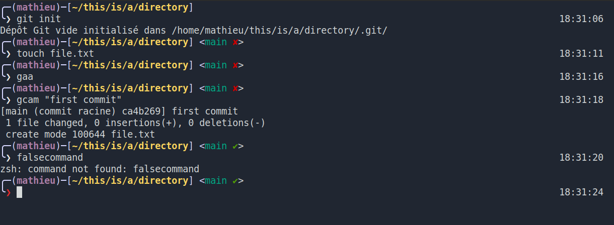

# Velvet - A basic OMZ theme



## How to install
If you don't have [oh my zsh](https://github.com/ohmyzsh/ohmyzsh) installed, first install it.

* Clone this repo in the directory of your choice
    ```
    cd <YOUR_PATH>
    git clone https://github.com/dor133/velvet-zsh-theme
    ```

* Copy the theme to your theme directory
    ```
    cp velvet.zsh-theme ~/.oh-my-zsh/themes
    ```

* Change your theme in the zsh config file (you can replace `nano` with your favourite file editor)
    ```
    nano ~/.zshrc
    ```
    Once editing, search for the line `ZSH_THEME="...`, and replace the name of the current theme with `velvet`

* Finally, reload the config
    ```
    source ~/.zshrc
    ```

Now enjoy !
